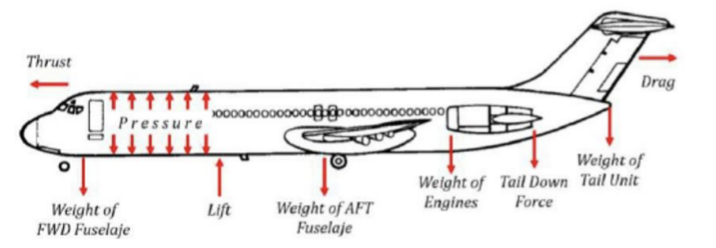
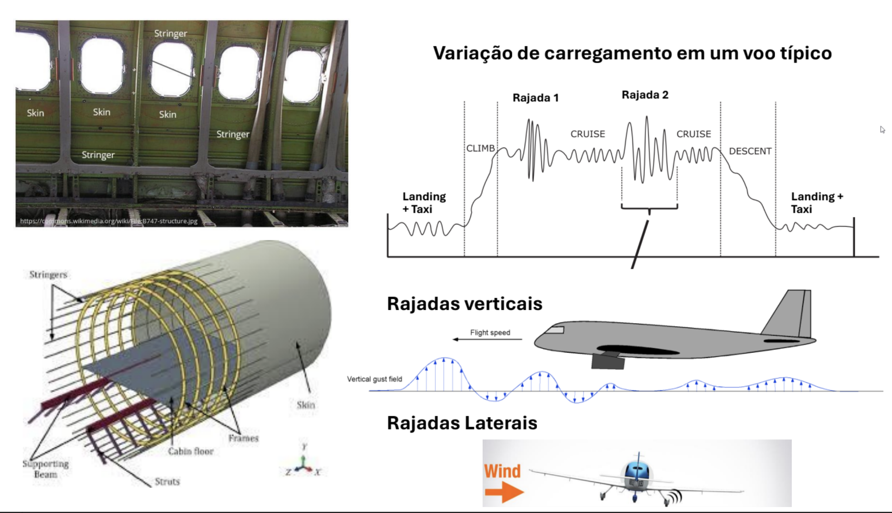

# projeto_ml_ita_2025_01

Este repositório contém o modelo desenvolvido para o trabalho da disciplina de Machine Learning do curso de pós-graduação do ITA — turma 2025.1.

Intregrantes do Grupo 

- Felipe Gomes
- Lennon Falcao
- Victor Hugo Reis Olegario

## Introdução

O tema do projeto aborda a **Falha por Fadiga e Curvas S-N**, fenômeno importante na análise de componentes sujeitos a carregamentos cíclicos. A falha por fadiga ocorre quando microtrincas se formam e crescem ao longo do tempo, mesmo que as tensões aplicadas estejam abaixo do limite de resistência do material.

### Pontos-chave:
- **Falha por fadiga**: processo de degradação progressiva causado por cargas repetidas.
- **Curvas S-N**: relacionam tensão aplicada (S) ao número de ciclos até falha (N), sendo fundamentais na estimativa de vida útil.
- **Fatores influentes**: incluem tensões locais, geometrias com entalhes, condições ambientais e histórico de carga.
- **Aplicação prática**: utilizada em projetos de engenharia aeronáutica, civil e automotiva para garantir segurança estrutural.

---

## Descrição do Problema

Aplicar o conceito de fadiga à aviação é essencial, pois aeronaves passam por ciclos repetitivos de pressurização, turbulência e pousos, que afetam diretamente sua estrutura.

### Como a fadiga afeta aviões:
- **Ciclos de voo** (pressurização/despressurização) geram esforços cíclicos.
- **Componentes críticos**: asas, fuselagem (rebites e junções), trem de pouso, motores, superfícies de controle.

### Curvas S-N na prática:
- Ajudam engenheiros a estimar quantos ciclos uma peça pode resistir antes de falhar.
- Base para definir intervalos de manutenção e substituição preventiva.

### Caso histórico:
- **De Havilland Comet (1950s)**: primeiros jatos comerciais. Sofreram falhas catastróficas por trincas de fadiga iniciadas em cantos quadrados das janelas, agravadas pelos ciclos de voo.

### Técnicas de mitigação:
- Uso de **cantos arredondados** para reduzir concentração de tensões.
- **Materiais resistentes à fadiga** (ex: ligas de titânio).
- **Inspeções não destrutivas** periódicas (END).
- **Controle de ciclos de voo** de cada peça (Life Cycle Management).

## Base de Dados

A base simula resultados estruturais de uma fuselagem submetida a diferentes situações operacionais. Os atributos incluem:

1. `EID`: identificador do componente  
2. `type`: tipo do componente (painel ou reforçador)  
3. `material`: tipo da liga metálica (1, 2 ou 3)  
4. `stress_landing`: esforço durante o pouso  
5. `stress_taxi`: esforço durante taxiamento  
6. `stress_vertical`: esforço com vento vertical  
7. `stress_lateral`: esforço com vento lateral  
8. `stress_pressurization`: esforço com pressurização  
9. `life`: número de ciclos até a falha  
10. `log_life`: logaritmo de `life` na base 10  
11. Arquivo: `aircraft_fatigue.csv`

  

## Software e Ferramentas

- Linguagem: **Python**
- Bibliotecas: `pandas`, `scikit-learn`, `matplotlib`
- Repositório GitHub: [acessar repositório](https://github.com/VictorOlegario/projeto_ml_ita_2025_01)

## Etapas do Projeto

  1.Introdução e limpeza de dados
  2.Análise exploratória
  4.Pré-processamento
  5.Testes com KNN e Árvore de Decisão
  6.Avaliação com MSE e R²
  7.Gráficos comparativos

  4.Pré-processamento:
- Remoção da coluna `EID`
- Conversão da variável `type` para valor numérico (LabelEncoder)
- One-hot encoding da variável `material`
- Reescalonamento das variáveis de stress para o intervalo **[-1, 1]**
- Geração de duas versões da base:
- Sem truncamento de `life`
- Com truncamento para valores de `life` acima de \(10^5\)
- Aplicação de `log(life)` para melhorar a distribuição

## Avaliação das Métricas

### Erro Quadrático Médio (MSE)
- Mede o quão distantes, em média, as previsões estão dos valores reais.
- Penaliza mais os grandes erros (elevação ao quadrado).
- Quanto menor, melhor.

### Erro Absoluto Médio (MAE)
- Média dos erros absolutos.
- Representa, em média, o quanto o modelo erra.
- Quanto menor, melhor.

### Raiz do Erro Quadrático Médio (RMSE)
- Raiz quadrada do MSE.
- Tem a mesma unidade da variável `y`.
- Dá mais peso a grandes erros.
- Quanto menor, melhor.

### Coeficiente de Determinação (R²)
- Mede o quanto da variabilidade dos dados o modelo explica.
- Varia de -∞ até 1.0.
- Quanto mais próximo de 1, melhor.

### R² CV Médio (Validação Cruzada)
- Média do R² nos folds da validação cruzada.
- Avalia o quão bem o modelo generaliza.
- Quanto mais próximo de 1, melhor.

### R² CV Std (Desvio Padrão)
- Mede a variação do R² entre os folds.
- Quanto menor, mais estável o modelo.

### Resumo das Métricas

| Métrica         | Objetivo Ideal               |
|-----------------|------------------------------|
| MAE             | Menor possível               |
| RMSE            | Menor possível               |
| MSE             | Menor possível               |
| R²              | Maior possível (até 1.0)     |
| R² CV Médio     | Maior possível (até 1.0)     |
| R² CV Std       | Menor possível (próximo de 0)|

## Abordagens Comparadas
1. **Original**: dados brutos
2. **Truncado**: valores de `life` limitados a 100.000
3. **Log**: aplicação de `log(life)` para melhorar a distribuição

## Resultados Comparativos

| Versão     | R² CV Médio | R² CV Std | Interpretação                  |
|------------|-------------|------------|-------------------------------|
| Original   | ~0.77       | Alta       | Instável e com risco de overfitting |
| Truncado   | ~1.00       | Baixíssimo | Modelo com alto ajuste, mas dados limitados |
| Log(life)  | **~1.00**   | **≈ 0**    | **Melhor equilíbrio entre ajuste e generalização** ✅ |

## Conclusões

A predição da vida útil por fadiga é significativamente melhorada com a transformação logarítmica. O modelo baseado em árvore de decisão com `log(life)` demonstrou excelente capacidade de generalização, sendo o mais indicado para aplicações práticas.

**Autor:** Victor Olegario  
**Curso:** Pós-graduação em Engenharia de Computação – ITA (2025.1)  

